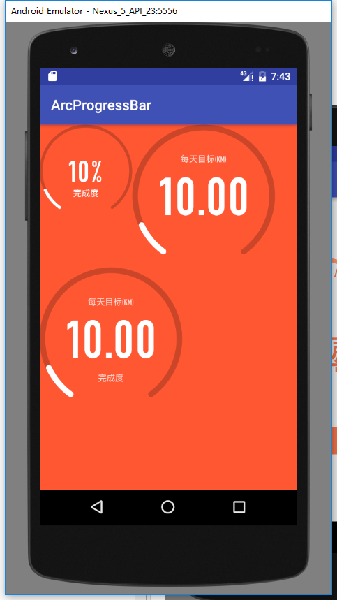

# ArcProgressBar
圆弧刻度进度条
## DEMO

```xml
    <com.woodnaonly.arcprogress.ArcProgress
        android:id="@+id/ArcProgress1"
        android:layout_width="130dp"
        android:layout_height="130dp"
        app:arc_finished_color="#fff"
        app:arc_max="100"
        app:arc_progress="10"
        app:arc_progress_suffix_text="%"
        app:arc_progress_suffix_text_color="@color/white"
        app:arc_progress_text_bottom_color="@color/white"
        app:arc_progress_text_bottom_size="12sp"
        app:arc_progress_text_bottom_text="完成度"
        app:arc_progress_text_color="@color/white"
        app:arc_progress_text_size="44sp"
        app:arc_unfinished_color="#cb4628"
        app:decimal_digits="0"/>
```
### Attributes
|name|format|description|
|:---:|:---:|:---:|
| arc_progress | integer | 初始值
| decimal_digits | integer | 小数位数
| arc_angle | float | 弧度
| arc_stroke_width | dimension | 宽度
| arc_max | integer | 最大值
| arc_unfinished_color | color | 底色
| arc_finished_color | color | 画弧度的颜色
| arc_progress_text_size | dimension | 进度文字的大小
| arc_progress_text_color | color | 进度文字的颜色
| arc_progress_text_top_text | string | 上面文字
| arc_progress_text_top_size | dimension | 上面文字的大小
| arc_progress_text_top_color | color | 上面文字的颜色
| arc_progress_text_bottom_text | string | 下面文字
| arc_progress_text_bottom_size | dimension | 下面文字的大小
| arc_progress_text_bottom_color | color | 下面文字的颜色
| arc_progress_suffix_text | string | 旁边的占位符
| arc_progress_suffix_text_size | dimension | 旁边的占位符的大小
| arc_progress_suffix_text_color | color | 旁边的占位符的颜色

